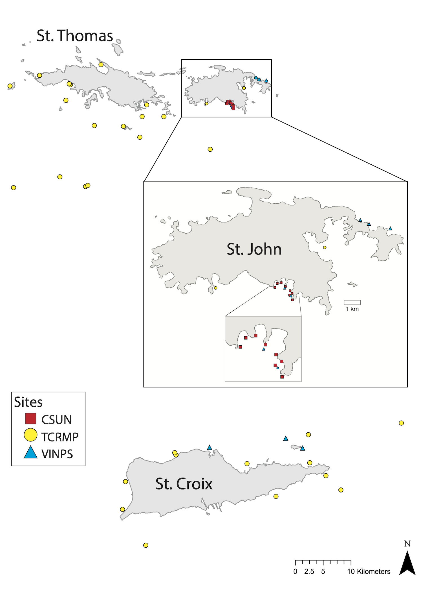

> Olinger LK, Edmunds PJ, Levitan D, Smith TB, Lasker H, Feeley M, Mahoney L, Dahl A. Reproductive mode, but not rarity, influences population trajectories in corals. In Review 2026.

## About this study

This site accompanies a manuscript on how reproductive mode and rarity relate to coral population trajectories in the U.S. Virgin Islands. It presents four analyses, one per monitoring program: TCRMP, VINPS, and CSUN, which track coral cover on the reef, and the Lasker octocoral program, which tracks octocoral colony density.

The coral-cover data behind the TCRMP, VINPS, and CSUN analyses comes from the Reef Code benthic cover section. The species-level file backs the TCRMP and VINPS analyses: [coral species cover download](). The genus-level file backs the CSUN analysis: [coral genera cover download](). The octocoral analysis uses a separate, standalone collaborator dataset from the Lasker program, bundled with this site rather than drawn from the benthic cover section.

### Two versions of each analysis

Each of the four analyses appears on this site in two versions. Open a program from the Publications menu to read the as-published version, then use the toggle at the top of the page to switch to the updated version and back.

The **as published** version reruns the analysis exactly as it appears in the manuscript. Each program clips the coral-cover or colony-survey data to the years used in the paper. TCRMP and VINPS clip to 2001 through 2023. CSUN clips to 1992 through 2023. The octocoral program clips to 2014 through 2024. A manuscript reports a result for a fixed dataset, so the published version locks the year range to match. Locking the year range is what lets a reader trace every number in the paper back to a specific, unchanging slice of the monitoring record, regardless of how much new data has been collected since.

The **updated since publication** version reruns the identical analysis: the same code, the same site scoping, and the same taxon scoping. Only the year range changes. It opens the year range to the full monitoring record bundled with this site. Monitoring for each program continues past the cutoff used in the paper, so the updated version extends the window to the most recent year available and lets the trajectories keep going. As new years are added to the underlying data files, the updated pages pick them up automatically the next time this site is rendered. The analysis itself does not change. Comparing the two versions side by side shows whether the pattern reported in the paper is holding, strengthening, or shifting as the monitoring record grows.

```{r overview-setup}
#| include: false
#| warning: false
#| message: false
suppressWarnings(suppressPackageStartupMessages({
  library(tidyverse); library(kableExtra)
}))
source("../_includes/_analysis_helpers.R")
repo_root <- find_repo_root()

# Load the published baseline classifications, which back the reproductive-mode table and the
# site table below. If the RData is not present yet (a first render before the analysis pages
# have run), those tables degrade gracefully.
asp <- setNames(lapply(c("TCRMP", "VINPS", "CSUN"), function(p)
  tryCatch(load_latest_program(p, "aspublished", dir = file.path(repo_root, "data", "rdata")),
           error = function(e) NULL)), c("TCRMP", "VINPS", "CSUN"))
have_asp <- all(!sapply(asp, is.null))
taxcol <- c(TCRMP = "coralSpecies", VINPS = "coralSpecies", CSUN = "coralGenera")
```

## The monitoring programs

{#fig-map width=85%}

Our study used time-series analyses on the fringing reefs of St. John, St. Thomas, and St. Croix, US Virgin Islands (@fig-map, @tbl-si-sites). Each program has been established for at least two decades, and each involves annual transect and quadrat surveys at permanent sites across the USVI with different taxonomic foci, resolution, methods, and spatial extent. While combining studies introduces limitations with respect to the contrasts that can be supported, as we show, independent analyses combine to create emergent properties when common results are obtained. For stony corals, the study conducted at the largest spatial scale was completed at 20 sites around all three islands since 2001 by the Territorial Coral Reef Monitoring Program (hereafter "TCRMP"; [@SmithEtAl2016; @KrampitzEtAl2022]). The study with most extensive sampling (n = 20 transects / site) was completed at 7 sites since 2001 by the VI National Park Service (hereafter "VINPS"; [@MillerEtAl2017; @RogersEtAl2009]). The longest study comes from 8 sites (7–14 m depth) between White Point and Cabritte Horn, St. John, that have been studied since 1992 by California State University Northridge (hereafter "CSUN"; [@EdmundsEtAl2024]).

### The Territorial Coral Reef Monitoring Program (TCRMP)

The Territorial Coral Reef Monitoring Program (TCRMP) was established in 2001 [@SmithEtAl2016]. Sites were selected to represent a range of reef types and depths across the US Virgin Islands. This analysis focuses on 20 shallow (0-20m) sites. At each site, benthic cover surveys are conducted annually along six 10 m long permanent transects marked with steel or brass rods. Video are recorded along transects with a high definition digital video recorder (most recently a Sony a6500 with Sola Video 3800 lights) located approximately 40 cm above the reef contour. After taping, non-overlapping images from each transect are captured and superimposed with randomly placed dots (380 points/transect). Living and non-living substrate are identified and used to calculate percent cover. Coral and some algae are identified to genera or species when possible, and sponges and gorgonians are identified by morphology. The video and images are permanently stored as a historical record of reef condition and are available for more detailed analyses [@KrampitzEtAl2022].

### The Virgin Islands National Park (VINPS)

The Virgin Islands National Park Service (VINPS) monitoring program data used here [@MillerEtAl2017; @RogersEtAl2009] focuses on 7 reefs (see @fig-map) around St. John and within Virgin Islands National Park, and within Buck Island Reef National Monument on St. Croix at 4 to 20 meters depth. Sites were chosen for their historical high coral cover, physical complexity, species diversity and high-relief, rugose habitat (linear reef) and well defined boundaries. The sampling employs 20 permanent marked and randomly selected 10 m transects that are recorded with a digital video camera (Panasonic DMC-GH4 fitted with two Light & Motion Sola Video 3800, and a 14 - 42 mm F/3.5-5.6 Olympus M.Zuiko lens) [@MillerEtAl2017]. The transects are marked by copper-clad start and end pins. The videos are analysed as sequential still "frames" and 10 dots are randomly placed upon each image and the substratum on which they occur is categorized as coral (by species), algae (macroalgae, turf, or crustose coralline), octocorals (sea fans, etc.), sponges, and bare substratum. The sites are typically surveyed annually in February to April in St. Croix and September to October in St. John.

### The California State University Northridge (CSUN)

The California State University Northridge (CSUN) program data [@EdmundsEtAl2024] come from an analysis of 8 sites that were established in 1992 on hard substrata at 7-9 m depth on the fringing reefs between White Point and Cabritte Horn. Sites were permanently marked with stainless steel poles, and each consisted of a single 20 m transect from 1992 to 2000, and thereafter were increased to 40 m. Transects were oriented along the isobath, and annually were sampled (mostly in July) using photoquadrats (0.5 $\times$ 0.5 m) placed at random positions every year. There were 18 photoquadrats/site from 1992 to 2000, and 40 photoquadrats/site thereafter. From 1992-2001 photoquadrats were recorded on color slide film in a Nikonos V camera, and thereafter were recorded digitally with cameras increasing from 3.3 megapixels (Nikon Coolpix 990) to 45.7 megapixels (Nikon D850). Cameras were fitted to a rigid framer that held them perpendicular to the reef, and images were illuminated with two strobes (Nikonos SB105). Color slides were digitized and all images were analyzed for benthic space holders using CPCe or CoralNET software. Images were overlaid with a grid of 200 randomly-located dots that were manually annotated by functional group and to the lowest taxonomic level possible for scleractinians. For this analysis, 8 sites were utilized and results are reported for scleractinians with genus resolution because of limited resolution on some of the images and the low coral cover encountered.

### Octocorals

As a comparison to the scleractinian coral data, another dataset of octocoral surveys was subjected to identical analyses. Octocoral data come from three sites (Grootpan Bay, Europa Bay, and Tektite) at 7–9 m depth on the southern shore of St. John, from 2014 (described in [@tsounis2018] and [@LaskerCite]). Briefly, octocorals are counted by species in 1 m$^2$ quadrats, randomly placed on each of 6 parallel, 10 m long transects, with surveys completed in July and August of each year. Censuses were not conducted in 2021 and 2023 due to logistical constraints, but event sampling was conducted in November 2017, shortly after Hurricanes Irma and Maria struck St. John. The number of quadrats sampled differed among transects based on the abundance of octocorals at each site, with sites having the fewest octocoral colonies sampled most intensively. The number of quadrats increased at all sites over the 10-year period to enhance resolution of the study. Quadrats were positioned randomly with respect to position along, and side of, the transect. Colonies were identified to species, or to a species group of 2 or 3 congeners.

```{r tbl-si-sites}
#| echo: false
#| tbl-cap: "Monitoring sites analyzed for each program, with island, depth, and the year the site entered monitoring, drawn from the site master and the scoped analysis data."
if (have_asp) {
  site_master <- read.csv("../data/site/00_RRS_siteMaster_allSites_data.csv")
  site_rows <- do.call(rbind, lapply(c("TCRMP", "VINPS", "CSUN"), function(p) {
    sites <- sort(unique(asp[[p]]$analysis_data$site))
    sm <- site_master[site_master$site %in% sites, ]
    data.frame(Program = p, Site = sm$site, Island = sm$island,
               `Depth (m)` = round(sm$depth, 1), `Year added` = sm$yearadded,
               check.names = FALSE)
  }))
  kbl(site_rows, align = c("l", "l", "l", "r", "r"),
      caption = NULL) |>
    kable_styling(bootstrap_options = c("striped", "hover", "condensed"), full_width = FALSE) |>
    collapse_rows(columns = 1, valign = "top")
}
```

## Reproductive mode and rarity

The following was repeated independently for each program. First, the highest taxonomic resolution of benthic cover data were aggregated for each site and year. For each taxon, we retained site-taxon combinations where the taxon was observed at least once during the study period, assuming that if a taxon was never observed at a site, that site lay outside the taxon's range. The first five years of the data were aggregated (2001-2005 for TCRMP and VINPS; 1992-1996 for CSUN) and taxa were sorted and categorized as common (representing the top 90% of cumulative cover) or rare (representing the bottom 10% of cumulative cover). Taxa not recorded during the baseline period were excluded from subsequent trend analyses, so that modeled slopes reflect only species present at the outset of each monitoring program (each program's excluded taxa are listed on its analysis page). A sliding window sensitivity analysis, in which the cumulative cover threshold was systematically varied across the species rank distribution, identified the 90% cumulative cover threshold as the strictest definition of rarity (i.e., the smallest rare group) at which temporal slope estimates remained insensitive to the reclassification of individual species between groups. Taxa were also categorized as broadcast spawners or brooding spawners (@tbl-species-traits). For genera-level data in CSUN, the genus was assigned the reproductive mode that is most common in the genus, or most common in the subspecies found in the region.

The 'baseline abundance' for coral taxa in each project was defined as the mean percentage cover across the first five years of sampling (starting 1992 for CSUN and 2001 for TCRMP and VINPS), and it was evaluated after the onset of regional coral mortality that commenced in the 1980s [@JacksonEtAl2014; @Rogers1985; @GardnerEtAl2003]. The determinations of rare and common are therefore not relative to a 'natural' reef [*sensu* @Jackson2001], but our baseline abundance ranks are similar to those prepared for Caribbean reefs in the 1950s and 1960s [@GoreauandWells1967] as well as the fossil record for at least 95,000 years [@Pandolfi2006]. *Orbicella* spp., for example, has remained one of the most abundant broadcasting corals in the present projects and has been recorded as a dominant reef-builder throughout the region in the fossil record from the Pleistocene [@Mesolella1967]. Populations of *O. annularis* and *O. faveolata* increased in abundance and spatial extent around 2–1 million years ago (MYA) following the Pliocene-Pleistocene extinction of the sister species *O. nancyi* [@PradaEtAl2016].

Abundance was measured as percentage cover, a standard metric for colonial organisms [@GardnerEtAl2003; @MillerEtAl2016], and we applied a $\log_{10}$ transformation to produce slope estimates representing annual proportional rates of change [@KerkhoffEnquist2009; @VanKlinkEtAl2024].

```{r tbl-species-traits}
#| echo: false
#| tbl-cap: "Every baseline taxon, its reproductive mode, and its common or rare status in each program. Species-level rows come from TCRMP and VINPS; genus-level rows come from CSUN. Rows are grouped by genus."
if (have_asp) {
  traits <- do.call(rbind, lapply(c("TCRMP", "VINPS", "CSUN"), function(p) {
    b <- asp[[p]]$baseline
    tcol <- taxcol[[p]]
    data.frame(Taxon = b[[tcol]], Genus = sub(" .*$", "", b[[tcol]]),
               Mode = as.character(b$Reproductive_mode), commonness = as.character(b$commonness),
               Program = p, stringsAsFactors = FALSE)
  }))
  mode_by_taxon <- traits |> group_by(Taxon) |> summarise(Mode = dplyr::first(Mode), Genus = dplyr::first(Genus), .groups = "drop")
  wide <- traits |>
    select(Taxon, Program, commonness) |>
    pivot_wider(names_from = Program, values_from = commonness, values_fill = "-") |>
    left_join(mode_by_taxon, by = "Taxon") |>
    arrange(Genus, Taxon) |>
    transmute(Taxon, `Repro. mode` = Mode, TCRMP, VINPS, CSUN)
  kbl(wide, align = c("l", "l", "c", "c", "c")) |>
    kable_styling(bootstrap_options = c("striped", "hover", "condensed"), full_width = FALSE) |>
    column_spec(1, italic = TRUE)
}
```

## References

::: {#refs}
:::
